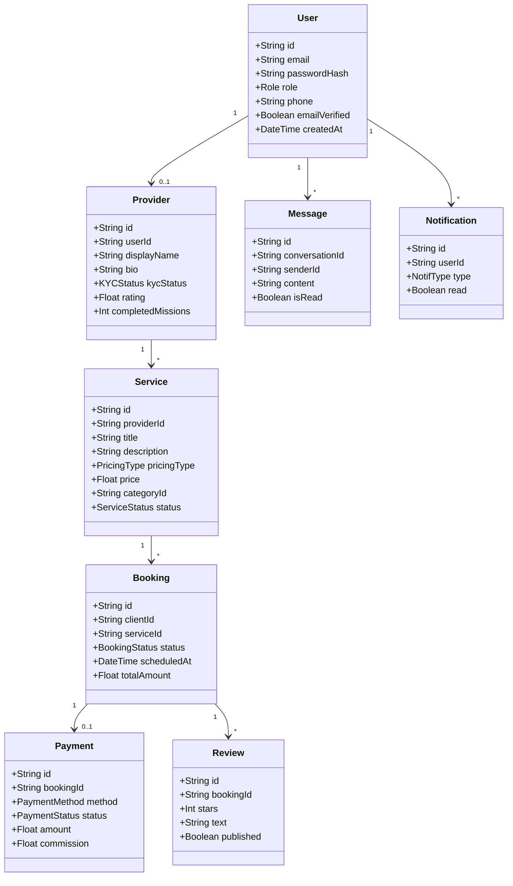
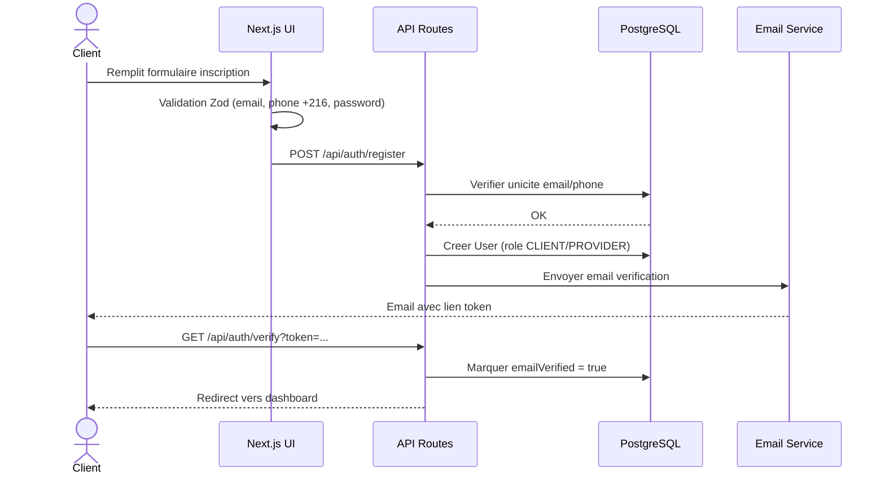
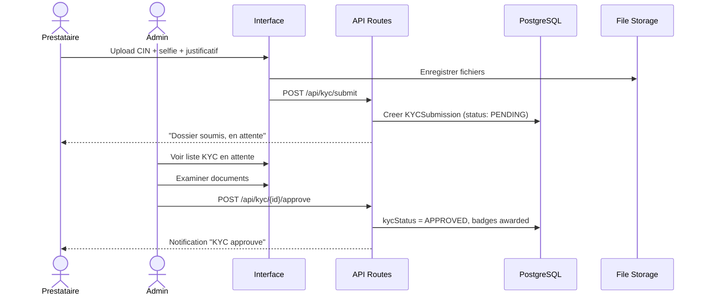
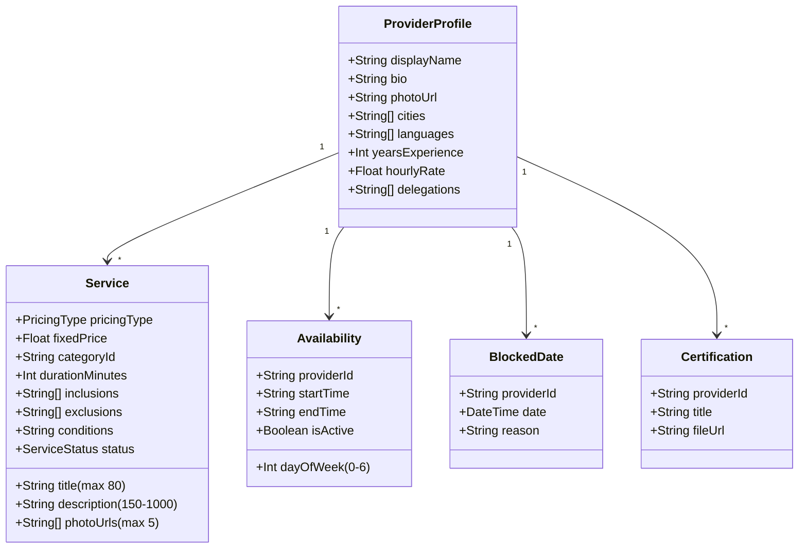
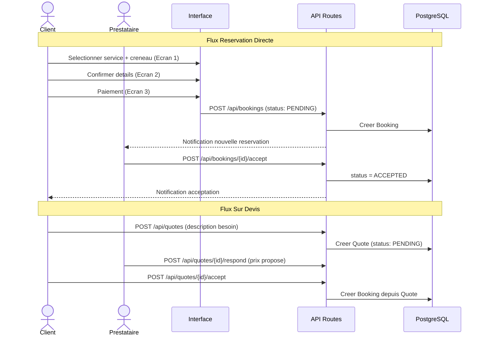
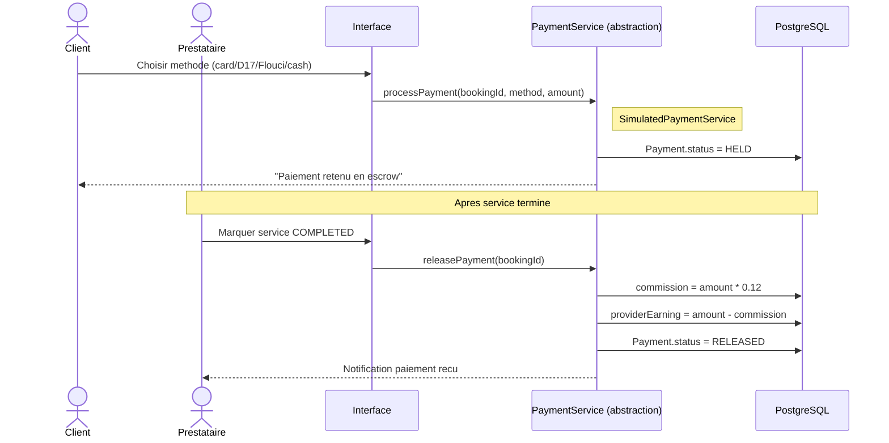
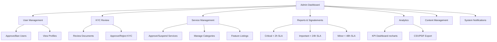

# Roadmap: Tawa Services

## Overview

Tawa Services est une plateforme marketplace de services locaux tunisienne construite en 11 sprints Agile/Scrum. Le projet part d'une fondation technique solide (Next.js 15, PostgreSQL, Prisma, next-intl) pour livrer progressivement : l'authentification et la gestion des roles, la verification KYC des prestataires, les profils et services, la recherche et decouverte, le systeme de reservation dual-flow (direct + sur devis), les paiements simules avec architecture Konnect-ready, les avis bidirectionnels, la messagerie en-app avec moderation, les notifications, le panneau d'administration complet, et enfin les donnees de demo et le polish PFE. Chaque phase livre une capacite verifiable et independante qui debloue la suivante.

## Phases

**Phase Numbering:**
- Integer phases (1..11): Sprints planifies
- Decimal phases: Insertions urgentes (marque INSERTED)

- [x] **Phase 1: Foundation & Infrastructure** - Scaffolding Next.js 15, schema Prisma, i18n next-intl, CI, layout global (completed 2026-02-22)
- [x] **Phase 2: Authentification** - Inscription, connexion, sessions, OAuth, RBAC, validation Tunisienne (completed 2026-02-22)
- [x] **Phase 3: Verification KYC** - Upload documents, workflow admin approval, trust badges prestataires (completed 2026-02-23)
- [x] **Phase 4: Profil Prestataire & Services** - Profil, listing services, disponibilites, zone d'intervention, statistiques (completed 2026-02-23)
- [x] **Phase 5: Recherche & Decouverte** - Parcourir par categorie, filtres ville/delegation, autocomplete, tri (completed 2026-02-24)
- [x] **Phase 6: Systeme de Reservation** - Booking direct + sur devis, statuts, tableau de bord prestataire, annulation (completed 2026-02-24)
- [x] **Phase 7: Paiement Simule** - Checkout Tunisien, escrow model, earnings dashboard, factures, abstraction layer (completed 2026-02-25)
- [x] **Phase 8: Avis & Evaluations** - Ratings bidirectionnels, criteres, photos, moderation, agregation (completed 2026-02-25)
- [ ] **Phase 9: Messagerie & Notifications** - Messagerie in-app, moderation contacts, notifications transactionnelles
- [ ] **Phase 10: Panneau d'Administration** - User management, KYC review, reports, analytics KPIs, content management
- [ ] **Phase 11: Demo Data, Polish & PFE Readiness** - Seed data, responsivite mobile, tests E2E, rapport-ready

## Phase Details

---

### Phase 1: Foundation & Infrastructure

**Sprint Goal**: L'equipe dispose d'un environnement de developpement fonctionnel avec base de donnees seedable, routage App Router operationnel, systeme i18n initialise et pipeline CI/CD pret — permettant a tous les sprints suivants de demarrer sans blocage technique.

**Depends on**: Nothing (premier sprint)

**Requirements**: UI-01, UI-02, UI-03, UI-04 (infrastructure uniquement pour ce sprint)

**Success Criteria** (what must be TRUE):
  1. Le projet demarre avec `npm run dev` sans erreur et affiche une page d'accueil avec layout global (navbar, footer, bottom nav mobile)
  2. Le schema Prisma contient tous les modeles v1 (User, Provider, Service, Booking, Payment, Review, Message, Notification) et les migrations s'appliquent sans erreur sur PostgreSQL
  3. Toutes les chaines UI sont chargees via `t('key')` avec next-intl — aucune chaine hardcodee visible dans le code source
  4. La mise en page est mobile-first : bottom navigation visible sur viewport < 768px, layout desktop sur >= 768px
  5. Le pipeline CI (lint + typecheck + tests) passe au vert sur chaque push

**Plans**: 7 plans

Plans:
- [x] 01-01-PLAN.md — Initialisation Next.js 15 App Router + TypeScript strict + ESLint + Prettier + env vars typees
- [ ] 01-02-PLAN.md — PostgreSQL + Prisma ORM: schema complet v1 (20+ modeles, CUID2, soft delete, localisation normalisee)
- [ ] 01-03-PLAN.md — next-intl: middleware routage par locale, dictionnaire fr.json, pattern t('key') global
- [ ] 01-04-PLAN.md — shadcn/ui + Tailwind: tokens design (bleu primaire, orange accent, rounded), composants de base, dark mode
- [ ] 01-05-PLAN.md — 3 layouts distincts: Navbar desktop, BottomNav mobile, Footer, AdminSidebar collapsible (checkpoint visuel)
- [ ] 01-06-PLAN.md — Types globaux TypeScript, schemas Zod de base (phone tunisien, auth), constantes metier, pages placeholder
- [ ] 01-07-PLAN.md — Pipeline CI GitHub Actions: lint + typecheck + build + prisma validate sur chaque push/PR

---

### Phase 2: Authentification

**Sprint Goal**: Tout utilisateur peut creer un compte, se connecter (email/password ou OAuth Google/Facebook), rester connecte entre sessions, reinitialiser son mot de passe, verifier son email et son numero de telephone — avec RBAC complet protegant toutes les routes par role.

**Depends on**: Phase 1

**Requirements**: AUTH-01, AUTH-02, AUTH-03, AUTH-04, AUTH-05, AUTH-06, AUTH-07, AUTH-08

**Success Criteria** (what must be TRUE):
  1. Un nouveau client peut s'inscrire avec email/mot de passe en choisissant son role (CLIENT ou PROVIDER), reoit un email de verification et ne peut pas acceder aux routes proteges avant verification
  2. Un utilisateur peut se connecter via Google ou Facebook et sa session persiste apres fermeture et reouverture de l'onglet
  3. Un utilisateur ayant oublie son mot de passe peut le reinitialiser via un lien email fonctionnel
  4. Un numero de telephone tunisien invalide (hors format +216 ou 8 chiffres) est rejete a l'inscription avec message d'erreur clair
  5. Un ADMIN accedant a `/admin`, un CLIENT accedant a `/provider/dashboard`, ou un PROVIDER accedant a `/admin` est redirige vers une page 403 ou la page de connexion appropriee

**Plans**: 7 plans

Plans:
- [x] 02-01-PLAN.md — NextAuth.js config: JWT strategy, CredentialsProvider + Google + Facebook, Prisma adapter, session callbacks, SessionProvider
- [x] 02-02-PLAN.md — Registration wizard: 3-step form (role, personal info, password/CGU), register server action, bcrypt hashing
- [ ] 02-03-PLAN.md — Login page: email/password form, OAuth buttons, progressive lockout (CAPTCHA + 15min lock), OAuth role selection
- [x] 02-04-PLAN.md — Email verification (Resend magic link) + password reset flow (1h token expiry)
- [ ] 02-05-PLAN.md — SMS OTP phone verification: ISmsService abstraction, simulated in dev, inline wizard step 4
- [ ] 02-06-PLAN.md — RBAC middleware: next-intl + auth combined, RoleGuard component, 403 page, route group protection
- [ ] 02-07-PLAN.md — Optional 2FA (TOTP + SMS), suspicious login detection, security settings page, final verification

---

### Phase 3: Verification KYC

**Sprint Goal**: Un prestataire peut soumettre ses documents d'identite (CIN/passeport, selfie, justificatif de domicile), un admin peut les examiner et approuver/rejeter dans l'interface d'administration, et les trust badges sont affiches automatiquement sur le profil apres approbation — bloquant toute mise en ligne de service sans KYC valide.

**Depends on**: Phase 2

**Requirements**: KYC-01, KYC-02, KYC-03, KYC-04, KYC-05, KYC-06

**Success Criteria** (what must be TRUE):
  1. Un prestataire connecte peut uploader 3 documents (CIN/passeport, selfie, justificatif domicile) depuis son dashboard et voir le statut "En attente de verification"
  2. Un admin peut voir la liste de toutes les demandes KYC en attente, visualiser les documents uploades et cliquer Approuver ou Rejeter avec commentaire optionnel
  3. Apres approbation admin, le badge "Identite Verifiee" apparait immediatement sur le profil prestataire sans action supplementaire
  4. Si un prestataire KYC non-approuve tente d'acceder a la page de creation de service, il est redirige vers la page de statut KYC avec message explicatif
  5. Le workflow KYC complet (soumission → approbation → badge) est tracable via les statuts PENDING, APPROVED, REJECTED en base de donnees

**Plans**: 5 plans

Plans:
- [x] 03-01-PLAN.md — KYC upload API route, submission server action, Zod schemas, i18n translations
- [ ] 03-02-PLAN.md — Provider KYC 4-step wizard (CIN recto/verso, selfie, justificatif) + status page
- [x] 03-03-PLAN.md — Admin KYC review interface (list, document viewer, approve/reject with reasons)
- [ ] 03-04-PLAN.md — Trust badges component + badge computation logic (identity, quick response, top provider)
- [ ] 03-05-PLAN.md — KYC guard banner on provider dashboard, admin KYC pending count, end-to-end verification

---

### Phase 4: Profil Prestataire & Services

**Sprint Goal**: Un prestataire KYC-approuve peut creer et publier un profil complet avec photo, bio, zones d'intervention, disponibilites — et lister des services avec tarification (fixe ou sur devis), photos de travaux, certifications, inclusions/exclusions — le tout visible par les clients sur des pages de profil publiques.

**Depends on**: Phase 3

**Requirements**: PROF-01, PROF-02, PROF-03, PROF-04, PROF-05, PROF-06, PROF-07, PROF-08

**Success Criteria** (what must be TRUE):
  1. Un prestataire peut remplir et sauvegarder son profil (nom, bio, photo, contact, villes couverts, langues, experience) et le voir publie sur une URL publique `/providers/{id}`
  2. Un prestataire peut creer un service avec titre (80 chars max), description (150-1000 chars), prix fixe ou "sur devis", categorie, duree, et jusqu'a 5 photos de travaux
  3. Un prestataire peut definir un calendrier de disponibilite hebdomadaire (jours et horaires) avec des dates bloquees specifiques
  4. Le profil public affiche les statistiques en temps reel : missions terminees, note moyenne, nombre d'avis, temps de reponse moyen
  5. Un service peut specifier des listes d'inclusions et d'exclusions claires, et des conditions particulieres

**Plans**: 5 plans

Plans:
- [ ] 04-01-PLAN.md — Backend profil prestataire: validations Zod, server actions CRUD, upload photo, i18n
- [ ] 04-02-PLAN.md — Backend services: CRUD server actions avec KYC guard, upload photos/certifications
- [ ] 04-03-PLAN.md — UI edition profil: formulaire, zones d'intervention, disponibilites, photo upload
- [ ] 04-04-PLAN.md — UI services: formulaire creation/edition, photos de travaux, My Services page
- [ ] 04-05-PLAN.md — Page profil public: header, statistiques, onglets Services/Avis/A propos, certifications

---

### Phase 5: Recherche & Decouverte

**Sprint Goal**: Un client peut parcourir les services par categorie, filtrer par ville/delegation, effectuer une recherche avec autocompletion en temps reel, trier les resultats par note/prix/disponibilite, filtrer par statut verifie et plage de prix — et visualiser des fiches prestataires completement informees.

**Depends on**: Phase 4

**Requirements**: SRCH-01, SRCH-02, SRCH-03, SRCH-04, SRCH-05

**Success Criteria** (what must be TRUE):
  1. Un client sur la page d'accueil peut cliquer sur une categorie (Plomberie, Menage, Cours, Electricite, etc.) et voir la liste des prestataires correspondants avec leurs notes et tarifs
  2. Un client peut filtrer les resultats par ville ou delegation tunisienne et voir uniquement les prestataires couvrant cette zone
  3. En tapant dans la barre de recherche, des suggestions apparaissent en moins de 300ms sans rechargement de page
  4. Un client peut trier les resultats par "Meilleure note", "Prix croissant", "Disponible maintenant" et filtrer par "Verifie uniquement" et plage de prix min/max
  5. En cliquant sur un prestataire, le client voit son profil complet avec portfolio photos, certifications, trust badges et tous ses avis

**Plans**: 5 plans

Plans:
- [x] 05-01-PLAN.md — Search API backend: validation schemas, categories API with counts, service search API with filters/sort/pagination, i18n keys (completed 2026-02-24)
- [x] 05-02-PLAN.md — Service detail page: image gallery, provider mini-card, inclusions/exclusions, action buttons, similar services, PublicServiceCard linking (completed 2026-02-24)
- [x] 05-03-PLAN.md — Category browsing + search results page: category grid, sidebar filters (Sheet mobile), sort dropdown, pagination, results grid (completed 2026-02-24)
- [x] 05-04-PLAN.md — Autocomplete search: API endpoint, debounce 300ms component, Navbar/BottomNav integration (completed 2026-02-24)
- [ ] 05-05-PLAN.md — Integration: homepage DB-driven categories, Navbar dynamic categories, end-to-end flow verification checkpoint

---

### Phase 6: Systeme de Reservation

**Sprint Goal**: Un client peut reserver un service a prix fixe en 3 ecrans maximum (service → details → paiement), envoyer une demande de devis pour un service "sur devis", le prestataire peut accepter/rejeter les reservations et devis, et les statuts de reservation progressent correctement avec la politique d'annulation appliquee.

**Depends on**: Phase 5

**Requirements**: BOOK-01, BOOK-02, BOOK-03, BOOK-04, BOOK-05, BOOK-06, BOOK-07, BOOK-08

**Success Criteria** (what must be TRUE):
  1. Un client peut reserver un service fixe en selectionnant un creneau disponible sur le calendrier du prestataire et confirmer en 3 ecrans maximum
  2. Un client peut envoyer une demande de devis en decrivant son besoin, et le prestataire dispose de 48h pour repondre avec un prix avant expiration automatique
  3. Un prestataire peut voir toutes ses reservations groupees par statut (En attente, Acceptees, En cours, Terminees, Annulees) dans son dashboard
  4. La progression des statuts PENDING → ACCEPTED → IN_PROGRESS → COMPLETED est correctement appliquee et visible par les deux parties
  5. Si un client annule une reservation, le remboursement applicable (100% > 48h, partiel 24-48h, 0% < 24h) est correctement calcule et affiche

**Plans**: 7 plans

Plans:
- [x] 06-01-PLAN.md — Backend booking: Prisma schema additions, Zod schemas, booking/quote CRUD actions, query actions, i18n keys (completed 2026-02-24)
- [x] 06-02-PLAN.md — Cancellation policy + quote expiration: refund tier calculation, cancel actions, cron endpoint (completed 2026-02-24)
- [x] 06-03-PLAN.md — Direct booking wizard: availability calendar, time slot picker, 3-step wizard, payment selector (completed 2026-02-24)
- [x] 06-04-PLAN.md — Quote request flow: quote form, response card, accept/decline flow (completed 2026-02-24)
- [x] 06-05-PLAN.md — Provider booking dashboard: tabbed list, action buttons, quote response, booking detail (completed 2026-02-24)
- [x] 06-06-PLAN.md — Client bookings pages: Mes reservations tabs, booking detail, status timeline, cancel dialog (completed 2026-02-24)
- [x] 06-07-PLAN.md — Navigation integration + end-to-end verification checkpoint (completed 2026-02-24)

---

### Phase 7: Paiement Simule

**Sprint Goal**: Un client peut payer une reservation via une interface de checkout presentant les methodes de paiement tunisiennes (carte, D17, Flouci, cash), le modele d'escrow est simule en base de donnees, les prestataires voient leurs gains et commissions, des factures sont generees automatiquement, et l'architecture est propre pour une integration Konnect future sans modification frontend.

**Depends on**: Phase 6

**Requirements**: PAY-01, PAY-02, PAY-03, PAY-04, PAY-05, PAY-06, PAY-07, PAY-08

**Success Criteria** (what must be TRUE):
  1. Apres confirmation d'une reservation, le client voit une page de paiement avec 4 methodes (carte bancaire, D17, Flouci, cash) et peut "payer" — le statut passe a HELD (escrow)
  2. Apres marquage service COMPLETED, le paiement est "libere" au prestataire avec deduction automatique de 12% de commission visible dans le dashboard
  3. Un prestataire peut voir dans son dashboard : gains cumules, paiements en attente, historique des transactions avec detail commission
  4. Une facture PDF ou HTML imprimable est generee automatiquement pour chaque transaction terminee, accessible par client et prestataire
  5. Le service de paiement est isole derriere une interface `IPaymentService` — remplacer la simulation par Konnect ne necessite que d'implementer cette interface

**Plans**: 5 plans

Plans:
- [x] 07-01-PLAN.md — IPaymentService abstraction layer + SimulatedPaymentService + escrow actions + i18n keys
- [x] 07-02-PLAN.md — Checkout page (4 payment methods, card form, fee breakdown) + confirmation page with reference number
- [x] 07-03-PLAN.md — Provider earnings dashboard (balance cards, monthly breakdown, transaction history, withdrawal requests)
- [x] 07-04-PLAN.md — Invoice generation (printable HTML template) + monthly statements + tax retention notice
- [ ] 07-05-PLAN.md — Navigation wiring (booking flow -> checkout, sidebar earnings) + end-to-end verification checkpoint

---

### Phase 8: Avis & Evaluations

**Sprint Goal**: Apres completion d'un service, le client et le prestataire peuvent chacun laisser une evaluation (1-5 etoiles avec criteres detailles, texte, jusqu'a 3 photos) dans une fenetre de 10 jours — les avis sont publies simultanement une fois les deux parties ont evalue — et les moyennes sont agregees et utilisees dans le tri des resultats de recherche.

**Depends on**: Phase 7

**Requirements**: REVW-01, REVW-02, REVW-03, REVW-04, REVW-05, REVW-06, REVW-07, REVW-08

**Success Criteria** (what must be TRUE):
  1. Un client peut noter un prestataire sur 4 criteres (qualite, ponctualite, communication, proprete) et laisser un texte libre et jusqu'a 3 photos dans les 10 jours suivant la fin du service
  2. Le prestataire peut egalement noter le client (systeme bidirectionnel) dans la meme fenetre de 10 jours
  3. Les avis des deux parties ne sont visibles publiquement que lorsque les deux ont soumis leur evaluation (publication simultanee)
  4. Un avis contenant des informations de contact (email, telephone) ou du contenu defamatoire est automatiquement signale et masque en attente de moderation
  5. La note moyenne sur le profil prestataire se met a jour immediatement apres publication des avis et est utilisee pour trier les resultats de recherche

**Plans**: 7 plans

Plans:
- [x] 08-01-PLAN.md — Backend: Zod schemas, review CRUD actions, auto-moderation utility, photo upload API, i18n keys (completed 2026-02-25)
- [x] 08-02-PLAN.md — Client review form: StarRating, CriteriaRatingGroup, ReviewPhotoUploader, ReviewForm, client review page (completed 2026-02-25)
- [x] 08-03-PLAN.md — Provider review form: provider review page, booking detail integration (bidirectional) (completed 2026-02-25)
- [x] 08-04-PLAN.md — Simultaneous publication logic, 10-day window enforcement, cron expiration job (completed 2026-02-25)
- [x] 08-05-PLAN.md — Review display: ReviewCard, ReviewsList, RatingBreakdown, CriteriaRadarChart components (completed 2026-02-25)
- [x] 08-06-PLAN.md — Provider profile Avis tab integration, admin review moderation page, rating aggregation (completed 2026-02-25)
- [x] 08-07-PLAN.md — Navigation wiring, booking list review indicators, end-to-end verification (completed 2026-02-25)

---

### Phase 9: Messagerie & Notifications

**Sprint Goal**: Un client et un prestataire peuvent echanger des messages in-app pour coordonner une reservation, le systeme bloque automatiquement le partage d'informations de contact, des notifications en-app et email sont envoyees pour tous les evenements transactionnels, et l'utilisateur peut configurer ses preferences de notification.

**Depends on**: Phase 6 (bookings necessaires pour conversations)

**Requirements**: MSG-01, MSG-02, MSG-03, MSG-04, NOTF-01, NOTF-02, NOTF-03, NOTF-04

**Success Criteria** (what must be TRUE):
  1. Un client et un prestataire partageant une reservation peuvent s'envoyer des messages depuis leurs interfaces respectives, avec historique conserve 12 mois
  2. Si un utilisateur tente d'envoyer un numero de telephone ou email dans un message, le message est bloque ou le contenu sensible masque avec explication
  3. Le badge de notifications dans la navbar affiche le nombre de messages non lus et se met a jour sans rechargement de page
  4. Un utilisateur reoit des notifications in-app pour : nouvelle reservation, acceptation/rejet, nouveau message, nouvel avis, paiement recu, approbation profil
  5. Un utilisateur peut desactiver certains types de notifications (ex: emails marketing) et definir des heures de silence depuis ses preferences

**Plans**: 5 plans

Plans:
- [x] 09-01-PLAN.md — Messaging backend: Zod schemas, server actions CRUD, message moderation, i18n keys
- [x] 09-02-PLAN.md — Notification backend: server actions, central dispatcher, email templates (Resend), i18n keys
- [x] 09-03-PLAN.md — Messaging UI: conversation list, chat view with 5s polling, message bubbles, read receipts
- [x] 09-04-PLAN.md — Notification UI: bell dropdown, notifications page (Tout/Non lus), preferences form
- [ ] 09-05-PLAN.md — Integration: wire notifications into all actions, nav links, Contacter button, E2E verification

---

### Phase 10: Panneau d'Administration

**Sprint Goal**: Un administrateur dispose d'un panneau de controle complet pour gerer les utilisateurs (approbation KYC, ban), les services (approbation/suspension, categories), les signalements avec SLA prioritises (critique <2h, important <24h, mineur <48h), un tableau de bord analytique avec KPIs exportables en CSV/PDF, et la gestion du contenu editorial de la plateforme.

**Depends on**: Phase 9

**Requirements**: ADMN-01, ADMN-02, ADMN-03, ADMN-04, ADMN-05, ADMN-06, ADMN-07, ADMN-08

**Success Criteria** (what must be TRUE):
  1. Un admin peut voir la liste de tous les utilisateurs, changer leur statut (actif/banni), approuver ou rejeter un dossier KYC avec commentaire
  2. Un admin peut approuver ou suspendre un service, creer/modifier/supprimer des categories, et mettre en avant des annonces
  3. Les signalements (reports) s'affichent avec leur priorite (critique/important/mineur) et le temps restant selon le SLA, et l'admin peut les traiter et fermer
  4. Le tableau de bord analytics affiche en temps reel : utilisateurs actifs, nombre de transactions, revenus totaux, taux de conversion, taux de satisfaction, repartitions par categorie et par region
  5. Un admin peut exporter n'importe quel rapport (utilisateurs, transactions, revenus) en CSV et PDF depuis l'interface

**Plans**: TBD (environ 7-9 plans)

Plans:
- [ ] 10-01: Layout admin — sidebar navigation, protection route ADMIN, breadcrumbs
- [ ] 10-02: Gestion utilisateurs — datatable filtre/tri, actions ban/unban, detail utilisateur
- [ ] 10-03: Interface KYC review — file documents en attente, visualiseur, approbation/rejet avec commentaire
- [ ] 10-04: Gestion services et categories — approbation services, CRUD categories, featured listings
- [ ] 10-05: Systeme signalements — liste reports priorisee, timer SLA, workflow traitement, cloture
- [ ] 10-06: Analytics dashboard — recharts graphiques KPIs, filtres periode, breakdown categories/regions
- [ ] 10-07: Export CSV/PDF — generation cote serveur, telechargement direct, selection colonnes
- [ ] 10-08: Gestion contenu — editeur FAQ, CGU, banners homepage, pages legales
- [ ] 10-09: Notifications systeme — envoi newsletters/notifications a segments utilisateurs

---

### Phase 11: Demo Data, Polish & PFE Readiness

**Sprint Goal**: La plateforme est completement prete pour la soutenance PFE : donnees de demo realistes seedees (prestataires, clients, services, reservations, avis, transactions en TND), toutes les pages sont responsives mobile-first, les flows E2E critiques sont testes et documentes, les performances Lighthouse sont acceptables, et le rapport technique peut referencer l'implementation reelle.

**Depends on**: Phase 10

**Requirements**: UI-01, UI-02, UI-03, UI-04 (completion des elements UI/UX et seed data)

**Note**: UI-01, UI-02, UI-03 sont partiellement couverts en Phase 1 (infrastructure). Phase 11 complete la mise en oeuvre complete et le polish final. UI-04 (seed data) est entierement livree ici.

**Success Criteria** (what must be TRUE):
  1. La base de donnees contient des donnees de demo realistes : au moins 10 prestataires verifies dans differentes categories et villes tunisiennes, 20+ services, 30+ reservations a divers statuts, 50+ avis, historique de transactions en TND
  2. Toutes les pages cles (accueil, recherche, profil, booking, dashboard client, dashboard prestataire, admin) sont entierement utilisables sur mobile (375px) et desktop (1280px) sans elements casses
  3. Le flow de demo complet (recherche → profil → reservation → paiement → avis) s'execute sans erreur sur les donnees seedees
  4. Les scores Lighthouse (performance, accessibilite, SEO) atteignent au minimum 75/100 sur les pages publiques
  5. Le switcher de langue est visible dans la navbar et le mecanisme i18n fonctionne — pret pour ajout traductions AR/EN

**Plans**: TBD (environ 5-7 plans)

Plans:
- [ ] 11-01: Script de seed — faker.js avec donnees tunisiennes realistes (noms, villes, prix TND, numeros +216)
- [ ] 11-02: Polish responsivite mobile — audit complet pages, corrections bottom nav, cards, forms sur mobile
- [ ] 11-03: Tests E2E flows critiques — Playwright ou Cypress : inscription → booking → paiement → avis → admin review
- [ ] 11-04: Optimisation performances — lazy loading images, Suspense boundaries, prefetch routes critiques
- [ ] 11-05: Audit accessibilite et SEO — meta tags, aria labels, og:image, sitemap, audit Lighthouse
- [ ] 11-06: Language switcher UI — composant selecteur langue dans navbar, pret pour ajout traductions
- [ ] 11-07: Documentation technique PFE — README deploiement, schema DB export, guide demarrage rapide

---

## Progress

**Execution Order:** 1 → 2 → 3 → 4 → 5 → 6 → 7 → 8 → 9 → 10 → 11

| Phase | Plans Complete | Status | Completed |
|-------|----------------|--------|-----------|
| 1. Foundation & Infrastructure | 7/7 | Complete    | 2026-02-22 |
| 2. Authentification | 7/7 | Complete   | 2026-02-22 |
| 3. Verification KYC | 5/5 | Complete   | 2026-02-23 |
| 4. Profil Prestataire & Services | 5/5 | Complete   | 2026-02-23 |
| 5. Recherche & Decouverte | 5/5 | Complete   | 2026-02-24 |
| 6. Systeme de Reservation | 7/7 | Complete    | 2026-02-24 |
| 7. Paiement Simule | 4/5 | In progress | 2026-02-24 |
| 8. Avis & Evaluations | 7/7 | Complete | 2026-02-25 |
| 9. Messagerie & Notifications | 3/5 | In Progress|  |
| 10. Panneau d'Administration | 0/9 | Not started | - |
| 11. Demo Data, Polish & PFE Readiness | 0/7 | Not started | - |

**Total plans estimated:** ~74 plans across 11 sprints
